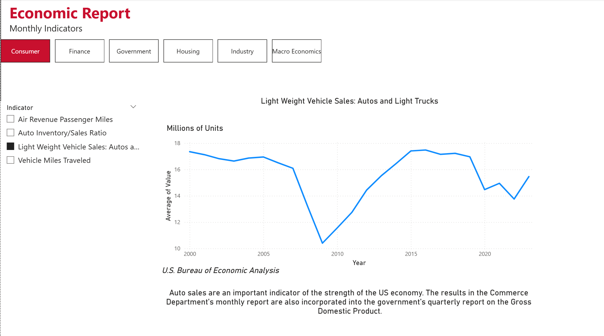
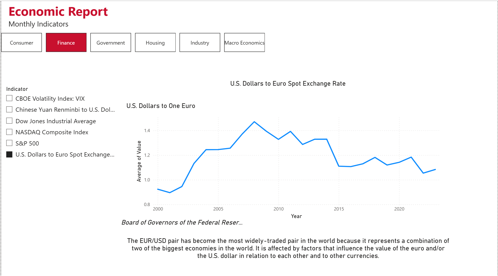

# Economic-Indicators-PowerBI-Dashboard

## Dashboard Preview

### Consumer Dashboard

### Finance Dashboard

### Macroeconomics Dashboard

---

## Overview

Developed an interactive Power BI dashboard to analyze U.S. economic indicators across multiple sectors, including consumer, finance, government, housing, industry, and macroeconomics. The project demonstrates end-to-end business intelligence techniques, including data transformation, data modeling, and interactive dashboard design.

---

## Features

- Multi-page interactive dashboard covering six economic sectors
- Dynamic filtering of economic indicators
- Time series analysis using interactive line charts
- Navigation between report pages
- Data source and indicator descriptions
- Clean dashboard layout designed for business reporting

---

## Dashboard Pages

- Consumer
- Finance
- Government
- Housing
- Industry
- Macro Economics

---

## Tools & Technologies

- Microsoft Power BI
- Power Query
- DAX
- Microsoft Excel

---

## Skills Demonstrated

- Data Transformation (ETL)
- Data Cleaning
- Data Modeling
- Dashboard Development
- Data Visualization
- Business Intelligence
- Interactive Reporting
